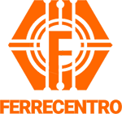

# E-Commerce de Ferretería

## Marca
**Nombre de la Marca**: FerreMundo

La marca FerreMundo ha sido creada específicamente para este proyecto, reflejando una identidad que evoca confianza, calidad y cercanía al cliente. El nombre combina "ferretería" y "mundo", sugiriendo una amplia gama de productos disponibles para todos los públicos.

### Logo
El logo de FerreMundo ha sido diseñado utilizando **CorelDRAW**, lo que permitió crear una representación visual moderna y profesional. Los colores utilizados representan la confianza y la calidad que la marca quiere ofrecer a sus clientes.

### Paleta de Colores
La paleta de colores fue seleccionada utilizando [Coolors](https://coolors.co), una herramienta que facilita la creación de esquemas de color armoniosos. Esta paleta fue elegida para transmitir una imagen coherente y atractiva que refleje la identidad de la marca.

### Favicon
El favicon de la página fue creado utilizando [favicon.io](https://favicon.io), una herramienta que permite generar íconos personalizados de manera sencilla.

## Diseño de la Página
- En la **página principal (index.html)** y en las **páginas en construcción (preguntasfrecuentes.html y productos.html)**, se utilizó `display: grid` para estructurar el contenido de manera eficiente y adaptativa.
- Para las **páginas de contacto.html y ubicacion.html**, se aplicó `display: flex`, lo que permite una distribución flexible de los elementos en la interfaz.

## Galería de Imágenes
Para implementar la galería de imágenes principal en `index.html`, se utilizó el siguiente tutorial de Instagram: [Tutorial de Galería](https://www.instagram.com/reel/DBG0q2_i3dA/?igsh=cWxhemZlZXlrM2Jo). Este recurso proporcionó ideas y técnicas útiles para crear una presentación atractiva de los productos.

## Herramientas de Diseño
Para el diseño de imágenes, fondos y el redimensionamiento de los mismos, se utilizaron las siguientes herramientas:
- **CorelDRAW**: Utilizado para crear y diseñar el logo, así como para el bosquejo del diseño.
- **Adobe Photoshop**: Empleado para el redimensionamiento de imágenes y ajustes de fondo, garantizando una presentación visual óptima.

## Inspiración
Este proyecto se inspiró en sitios web como [ferreteriaexpres.com.ar](https://ferreteriaexpres.com.ar) y [comercialcmp.com.ar](https://www.comercialcmp.com.ar), entre otros. Estas referencias ayudaron a definir la estructura y el diseño del eCommerce.

## Recursos Utilizados
- **Imágenes y Videos**: Se utilizaron imágenes y videos sin regalías de [Pixabay](https://pixabay.com).
- **Fuentes**: Se buscaron fuentes gratuitas en [Google Fonts](https://fonts.google.com), utilizando **Montserrat** y **Caveat**.
- **Íconos**: Se utilizaron íconos de [FontAwesome](https://fontawesome.com).

## Despliegue
La página ha sido desplegada en **GitHub Pages** y **Netlify**, asegurando que esté disponible y accesible para los usuarios.

- **GitHub Pages**:
  - [Página Principal](https://fernando-i-005.github.io/talentoTech2024/)
 

- **Netlify**:
  - [Página Principal](https://tu-proyecto.netlify.app/index.html)
 

## Propósito del Proyecto
El objetivo de este proyecto es desarrollar un sitio web de comercio electrónico para una ferretería en Argentina, que permita a los usuarios explorar y adquirir productos de manera fácil y eficiente. La plataforma busca ofrecer una experiencia de compra intuitiva y atractiva, adaptada a las necesidades del cliente argentino.

## Objetivos Específicos
- **Facilitar la navegación**: Crear un diseño limpio y sobrio que permita a los usuarios encontrar productos sin complicaciones.
- **Mostrar productos de manera efectiva**: Utilizar imágenes de alta calidad y descripciones claras para resaltar las características de cada producto.
- **Ofrecer un proceso de compra sencillo**: Implementar un carrito de compras intuitivo y un sistema de pago seguro.
- **Crear confianza y profesionalismo**: Utilizar una paleta de colores armoniosa y una tipografía elegante para transmitir la identidad de la ferretería.

## Público Objetivo
Este sitio está dirigido a:
- **Hogares** que buscan herramientas y suministros para proyectos de bricolaje.
- **Profesionales** del área de construcción y mantenimiento que requieren productos de calidad.
- **Empresas** que necesiten abastecerse de materiales y herramientas.

## Diseño y Estética
El diseño se enfoca en la simplicidad y la elegancia. La paleta de colores seleccionada busca ser armoniosa y representar la confiabilidad de la marca. La tipografía elegida mejora la legibilidad y proporciona una estética profesional.

## Tecnologías Utilizadas
- **HTML** para la estructura básica.
- **CSS** para estilos y diseño responsivo.
- **JavaScript** para interactividad y funcionalidad (próximamente).

## Conclusión
Este proyecto de eCommerce busca no solo vender productos, sino también ofrecer una experiencia completa que resuelva las necesidades de los clientes de manera efectiva. La plataforma se propone ser un punto de referencia en el ámbito de la ferretería en línea en Argentina.

